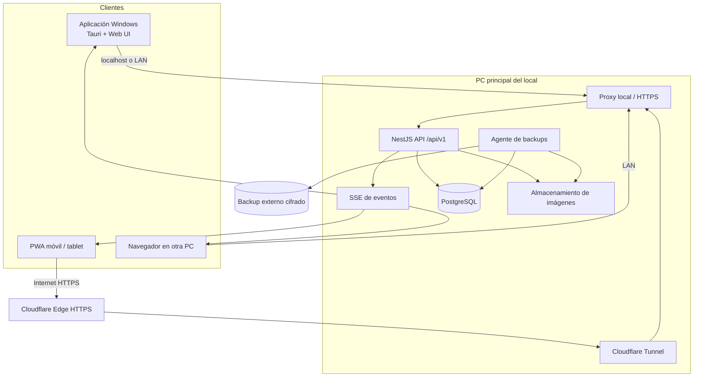
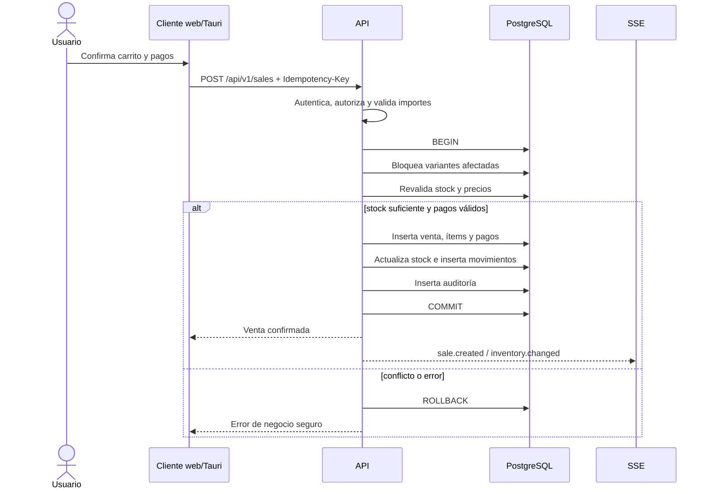

# Fase 1 — Arquitectura del sistema

## 1. Alcance y principios

El sistema será una aplicación única con varios clientes. La aplicación Windows y la PWA consumen el mismo backend; PostgreSQL es la única fuente de verdad. No habrá una base separada en el celular ni lógica crítica confiada al frontend.

Principios:

- **Local-first para la PC principal:** ventas, stock y administración siguen funcionando sin Internet.
- **Una sola fuente de verdad:** todo cambio persistente pasa por la API y PostgreSQL.
- **Seguridad por defecto:** servicios internos no publicados, mínimo privilegio y permisos en backend.
- **Transacciones para operaciones comerciales:** una venta, compra, devolución o ajuste se confirma completa o no se confirma.
- **Modularidad sin microservicios prematuros:** monolito modular desplegable como un solo servicio, preparado para separar módulos si el crecimiento lo exige.
- **Trazabilidad:** inventario, precios, permisos y operaciones sensibles dejan historial y auditoría.

## 2. Tecnologías elegidas

| Capa | Tecnología | Motivo |
|---|---|---|
| Monorepo | npm workspaces + Turborepo | Compartir tipos, validaciones y componentes con builds reproducibles. |
| Web/PWA | Next.js + React + TypeScript | SSR cuando aporte valor, excelente ecosistema, PWA y diseño responsive. |
| UI | Tailwind CSS + componentes accesibles basados en Radix UI | Consistencia visual, accesibilidad y velocidad de desarrollo sin acoplarse a un tema rígido. |
| Datos en cliente | TanStack Query + React Hook Form + Zod | Caché controlada, invalidación explícita y formularios tipados. |
| Escritorio | Tauri 2 | Instalador liviano, menor consumo que Electron y reutilización del frontend. |
| Backend | NestJS + TypeScript | Módulos, inyección de dependencias, guards, validación y testing maduros. |
| API | REST `/api/v1` + SSE para invalidaciones/eventos | REST es simple de operar; SSE cubre actualización inmediata sin la complejidad de WebSocket bidireccional. |
| Persistencia | PostgreSQL 17 | Transacciones, bloqueos, integridad, índices y operación local robusta. |
| ORM | Prisma | Modelo tipado, migraciones y buen soporte PostgreSQL. SQL explícito para bloqueos/consultas críticas. |
| Validación | Zod en paquetes compartidos y DTOs validados en backend | Contratos coherentes sin confiar en el navegador. |
| Autenticación | Sesiones opacas en cookie HttpOnly | Revocación simple, menor exposición que tokens persistidos en el cliente. |
| Password hashing | Argon2id | Resistencia adecuada para contraseñas con parámetros ajustables. |
| Logs | Pino estructurado con rotación | Rendimiento y registros consultables sin incluir secretos. |
| Tests | Vitest/Jest, Supertest y Playwright | Unitarios, integración con DB real y E2E de flujos críticos. |
| Acceso remoto | Cloudflare Tunnel | HTTPS externo sin abrir puertos entrantes ni exponer PostgreSQL. |
| Backups | `pg_dump` + restic hacia destino externo | Copias portables, cifrado, retención y verificación. |
| Instalación Windows | Tauri NSIS + bootstrapper Inno Setup + PostgreSQL nativo + servicios con WinSW | Menor consumo que Docker/WSL, instalación/desinstalación y arranque automático controlados. |

Las versiones exactas se fijarán al iniciar Fase 2 usando versiones LTS/estables vigentes y un lockfile. No se usarán dependencias `latest` sin fijar.

## 3. Diagrama lógico



## 4. Topología y puertos

- PostgreSQL escucha únicamente en loopback o red privada restringida por firewall; nunca se publica en Internet.
- El backend escucha en `127.0.0.1` por defecto. El proxy local y Cloudflare Tunnel son los únicos consumidores externos autorizados.
- La aplicación Tauri usa el endpoint local cuando corre en la PC principal. Por eso continúa operativa sin Internet.
- Cloudflare Tunnel publica exclusivamente el frontend y `/api/v1`; paneles administrativos, métricas internas y PostgreSQL quedan fuera.
- Para acceso LAN se ofrecerá una URL local. HTTPS en LAN se resolverá con certificado interno administrado por el instalador o se usará el dominio público cuando haya Internet.

## 5. Componentes del backend

El backend será un monolito modular. Cada módulo contiene controlador, servicio de aplicación, dominio, repositorio/queries y DTOs, sin acceso directo entre tablas desde controladores.

Módulos previstos:

- `auth`: login, logout, sesiones, bloqueo, recuperación y cambio de contraseña.
- `iam`: usuarios, roles, permisos y asignaciones.
- `catalog`: productos, variantes, categorías, marcas, colores, talles, materiales, géneros e imágenes.
- `inventory`: existencias, movimientos, ajustes, alertas y reposición.
- `sales`: POS, ventas, pagos, anulaciones, devoluciones y cambios.
- `customers`: CRM, métricas e historial de compras.
- `suppliers`: proveedores, compras e ingreso de mercadería.
- `pricing`: precios vigentes, promociones e historial.
- `reports`: consultas agregadas, exportaciones y dashboard.
- `imports`: previsualización, validación, duplicados y confirmación de CSV/XLSX.
- `audit`: eventos auditables y consulta restringida.
- `settings`: negocio, moneda, zona horaria y catálogos configurables.
- `files`: imágenes, thumbnails y límites de almacenamiento.
- `health`: API, DB, disco, backups y versión.

## 6. Flujo de datos en una venta



La concurrencia se resuelve en PostgreSQL dentro de la transacción, bloqueando las filas de variantes en orden estable o mediante una actualización condicional (`stock >= cantidad`). El stock que muestra el frontend nunca se considera autorización para vender.

## 7. Estructura de carpetas propuesta

```text
crm-localderopa/
├─ apps/
│  ├─ api/                    # NestJS
│  ├─ web/                    # Next.js + PWA
│  └─ desktop/                # Shell Tauri
├─ packages/
│  ├─ contracts/              # Esquemas, DTOs y eventos compartidos
│  ├─ ui/                     # Componentes accesibles
│  ├─ config/                 # ESLint, TypeScript y tooling
│  └─ domain/                 # Tipos/funciones puras sin infraestructura
├─ database/
│  ├─ prisma/
│  ├─ migrations/
│  └─ seed/
├─ infrastructure/
│  ├─ windows/                # Servicios, firewall e instalador
│  ├─ cloudflare/
│  └─ backup/
├─ docs/
├─ tests/
│  ├─ integration/
│  └─ e2e/
├─ .env.example
├─ package-lock.json
└─ turbo.json
```

## 8. Contrato de API

- Prefijo: `/api/v1`.
- JSON con identificadores UUID y dinero serializado como string decimal.
- Paginación cursor-based para listados grandes; offset solo en reportes acotados.
- Filtros, orden y búsqueda definidos por DTOs con listas permitidas.
- `Idempotency-Key` obligatorio para ventas, compras, devoluciones y operaciones que puedan reenviarse.
- Errores con `code`, `message`, `details` seguros y `requestId`; nunca stack traces al cliente.
- OpenAPI generado desde el backend y usado para comprobar compatibilidad.
- SSE emite eventos mínimos de invalidación; el cliente vuelve a consultar datos autorizados.

## 9. Aplicación Windows y arranque automático

El instalador será un bootstrapper firmado que:

1. Verifica Windows compatible, arquitectura, espacio y permisos administrativos.
2. Instala PostgreSQL nativo x64 en modo silencioso, únicamente servidor y herramientas de línea de comandos, con credenciales generadas localmente. No instala Docker, WSL, pgAdmin ni StackBuilder.
3. Crea base, rol de aplicación con mínimo privilegio y aplica migraciones.
4. Instala backend, proxy/túnel, tareas de backup y health monitor como servicios de Windows.
5. Instala la aplicación Tauri, accesos directos e iconos.
6. Configura firewall solo para los endpoints necesarios.
7. Ejecuta un chequeo inicial y abre el asistente para crear el administrador.
8. Guarda secretos con ACL restringidas y, cuando aplique, DPAPI; no en el repositorio.

PostgreSQL se ejecuta como servicio de Windows con inicio automático, escucha exclusivamente en `127.0.0.1` y se ajusta según RAM/CPU disponibles. El instalador utiliza una versión mayor soportada y fija el último parche probado; las actualizaciones menores se validan antes de distribuirse.

La actualización se hará con paquetes versionados, migraciones compatibles y rollback de binarios. Nunca se revierte una migración destructiva automáticamente.

## 10. Decisiones pendientes antes de producción

Estas decisiones no bloquean el núcleo, pero deben resolverse antes de Fase 6/7:

- Dominio definitivo para acceso remoto.
- Destino externo de backups: OneDrive, Google Drive o S3 compatible.
- Impresora/tamaño de ticket y etiquetas del local.
- Necesidad fiscal inicial y estrategia futura de ARCA.
- Política de conservación de auditoría y ventas según asesoramiento contable/legal.
- Certificado de firma de código para el instalador de Windows.
