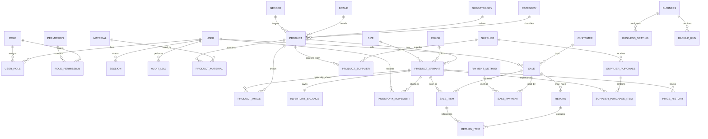

# Fase 1 — Modelo de datos

## 1. Convenciones

- Claves primarias UUID (`uuid`/UUIDv7 cuando la biblioteca elegida esté madura).
- Fechas técnicas en `timestamptz` y presentación en la zona horaria configurada del negocio.
- Dinero en `numeric(19,4)` y código ISO 4217; nunca `float`/`double`. La API lo serializa como string.
- Cantidades de stock en `integer` mientras no se vendan fracciones.
- Porcentajes en puntos base (`integer`) o `numeric`, según el caso.
- Entidades importantes usan `created_at`, `updated_at`, `archived_at` y, cuando corresponde, `created_by`/`updated_by`.
- Datos comerciales históricos se capturan en snapshots de los ítems. Cambiar el nombre o precio actual no reescribe una venta pasada.
- Las tablas operativas no se eliminan físicamente desde la aplicación.

## 2. Diagrama de dominios

## 3. Identidad y permisos

### `users`

`id`, `username` (CITEXT unique), `display_name`, `email`, `password_hash`, `status`, `failed_login_count`, `locked_until`, `last_login_at`, `password_changed_at`, timestamps, `archived_at`.

### `roles`

`id`, `code` unique, `name`, `description`, `is_system`, timestamps, `archived_at`.

### `permissions`

`id`, `code` unique (`sales.create`, `inventory.adjust`, etc.), `module`, `description`.

### `user_roles` y `role_permissions`

Tablas puente con PK compuesta, foreign keys y fecha/usuario de asignación.

### `sessions`

`id`, `user_id`, `token_hash` unique, `csrf_secret_hash`, `ip`, `user_agent`, `created_at`, `last_seen_at`, `expires_at`, `revoked_at`, `revoke_reason`.

Nunca se guarda el token de sesión en claro.

## 4. Catálogo de ropa

### `products`

`id`, `name`, `slug`, `description`, `category_id`, `subcategory_id`, `brand_id`, `gender_id`, `garment_type_id`, `season_id`, `collection_id`, `default_supplier_id`, `status`, `min_stock`, `entry_date`, `notes`, timestamps y archivo lógico.

El producto representa el modelo general; color/talle/SKU/código de barras y stock viven en la variante.

### `product_variants`

`id`, `product_id`, `color_id`, `size_id`, `sku` unique, `barcode` unique nullable, `cost_amount`, `sale_price_amount`, `wholesale_price_amount`, `currency_code`, `min_stock_override`, `status`, timestamps y archivo lógico.

Restricción única por combinación relevante del producto para impedir variantes duplicadas. Los campos de dinero deben ser no negativos.

### Catálogos configurables

`categories`, `subcategories`, `brands`, `colors`, `sizes`, `materials`, `genders`, `garment_types`, `seasons`, `collections` comparten: `id`, `code`, `name`, `sort_order`, `is_active`, timestamps. No se modelan como enums rígidos.

`product_materials` permite materiales múltiples y porcentaje opcional. `product_suppliers` relaciona proveedores, códigos externos, último costo y proveedor preferido.

### `product_images`

`id`, `product_id`, `variant_id` nullable, `storage_key`, `mime_type`, `width`, `height`, `byte_size`, `sort_order`, `is_primary`, `checksum`, timestamps.

## 5. Inventario

### `inventory_balances`

`variant_id` PK/FK, `quantity`, `reserved_quantity`, `version`, `updated_at`.

Checks: cantidades no negativas. `version` permite control optimista donde sea útil; las ventas usan control transaccional en DB.

### `inventory_movements`

`id`, `variant_id`, `type`, `quantity_delta`, `quantity_before`, `quantity_after`, `reason_code`, `notes`, `reference_type`, `reference_id`, `user_id`, `occurred_at`, `created_at`.

Es append-only desde la aplicación. `quantity_after = quantity_before + quantity_delta` se valida en el servicio y mediante restricciones/triggers mínimos donde aporte defensa adicional.

Tipos iniciales: `INITIAL`, `PURCHASE`, `SALE`, `RETURN`, `EXCHANGE_IN`, `EXCHANGE_OUT`, `ADJUSTMENT`, `LOSS`, `DAMAGED`, `CORRECTION`, `SALE_VOID`.

## 6. Ventas y pagos

### `sales`

`id`, `sale_number` unique, `status`, `customer_id` nullable, `seller_user_id`, `subtotal_amount`, `discount_amount`, `total_amount`, `cost_amount`, `profit_amount`, `currency_code`, `notes`, `sold_at`, `voided_at`, `voided_by`, `void_reason`, timestamps.

### `sale_items`

`id`, `sale_id`, `variant_id`, `quantity`, snapshots de `sku`, `barcode`, `product_name`, `variant_name`, `unit_cost_amount`, `unit_price_amount`, `discount_amount`, `line_total_amount`, `line_cost_amount`, `line_profit_amount`, `currency_code`.

### `payment_methods`

`id`, `code`, `name`, `is_active`, `requires_reference`, `sort_order`, timestamps.

### `sale_payments`

`id`, `sale_id`, `payment_method_id`, `amount`, `reference`, `received_at`, `created_by`. La suma debe igualar el total al confirmar la venta.

### Devoluciones y cambios

`returns`: cabecera, venta original, tipo, estado, importes, usuario, motivo y fecha.

`return_items`: referencia al ítem vendido, cantidad, resolución, importe devuelto y variante entrante/saliente si es cambio.

Un cambio se representa como devolución de unidades originales más salida de unidades nuevas, manteniendo referencias cruzadas y movimientos de inventario.

## 7. Clientes y proveedores

### `customers`

`id`, `first_name`, `last_name`, `document_type`, `document_number`, `phone`, `whatsapp`, `email`, `address_*`, `birth_date`, `notes`, `registered_at`, timestamps y archivo lógico.

Totales, ticket promedio y última compra se calculan desde ventas confirmadas o desde una proyección actualizable; no se duplican como verdad primaria.

### `suppliers`

`id`, `name`, `company_name`, `tax_id`, `phone`, `whatsapp`, `email`, `address_*`, `notes`, timestamps y archivo lógico.

### `supplier_purchases`

`id`, `purchase_number`, `supplier_id`, `status`, `purchase_date`, `subtotal_amount`, `total_amount`, `currency_code`, `payment_method_text`, `notes`, `created_by`, `confirmed_at`, timestamps.

### `supplier_purchase_items`

`id`, `purchase_id`, `variant_id`, `quantity`, `unit_cost_amount`, `line_total_amount`, `currency_code`, snapshots descriptivos.

La confirmación de compra, el ingreso de stock, el movimiento y cualquier actualización de costo ocurren en una sola transacción.

## 8. Precios, promociones y auditoría

### `price_history`

`id`, `variant_id`, `price_type`, `old_amount`, `new_amount`, `currency_code`, `reason`, `valid_from`, `valid_until`, `changed_by`, `changed_at`.

### `promotions`

`id`, `name`, `type`, `value`, `starts_at`, `ends_at`, `priority`, `is_active`, condiciones JSON validadas y timestamps. Su primera versión se limitará a reglas explícitas y auditables.

### `audit_logs`

`id`, `actor_user_id` nullable, `action`, `entity_type`, `entity_id`, `before_data` JSONB, `after_data` JSONB, `ip`, `user_agent`, `request_id`, `occurred_at`.

Append-only, con redacción de hashes, tokens, secretos y datos innecesarios. Se indexa por fecha, actor, acción y entidad.

## 9. Configuración y operación

- `businesses`: nombre, logo, CUIT, contacto, moneda y zona horaria. Inicialmente una sola fila, pero con `business_id` previsto en entidades agregadas para futura expansión.
- `business_settings`: clave tipada, valor JSON validado, versión y auditoría.
- `idempotency_keys`: clave, usuario, operación, hash de request, estado, respuesta y expiración.
- `import_jobs` / `import_rows`: archivo, estado, resumen, errores por fila y usuario.
- `export_jobs`: tipo, filtros, formato, ubicación, estado y caducidad.
- `backup_runs`: inicio/fin, tipo, destino, checksum, tamaño, estado y error seguro.
- `outbox_events`: eventos confirmados en la misma transacción para notificaciones/SSE confiables.

## 10. Índices esenciales

- Trigram/GIN para búsqueda normalizada de producto, marca y proveedor; B-tree para SKU/barcode exactos.
- `product_variants(product_id, status)` y claves únicas parciales para registros no archivados.
- `inventory_movements(variant_id, occurred_at desc)` y `(reference_type, reference_id)`.
- `sales(sold_at desc)`, `(customer_id, sold_at desc)`, `(seller_user_id, sold_at desc)`, `(status, sold_at)`.
- `sale_items(variant_id, sale_id)`.
- `audit_logs(occurred_at desc)`, `(actor_user_id, occurred_at desc)`, `(entity_type, entity_id, occurred_at desc)`.
- Índices parciales para stock bajo y sin stock, evaluando la estrategia final con `EXPLAIN ANALYZE`.

Para tablas que crezcan mucho se evaluará partición temporal solo con evidencia; 500.000 movimientos no justifican por sí solos complejidad prematura.

## 11. Reglas críticas de integridad

- Precio, costo, pagos y totales no negativos.
- SKU único y código de barras único cuando exista.
- Stock no negativo en ventas normales; ajustes negativos requieren permiso especial y motivo.
- Cantidades de ítems mayores que cero.
- Una venta confirmada debe tener ítems y pagos cuyo total coincida.
- Una anulación no edita la venta: cambia estado y genera movimientos compensatorios.
- Catálogos referenciados no se eliminan; se desactivan.
- Migraciones aplicadas en orden, registradas y probadas sobre copia de producción antes de actualizar.
